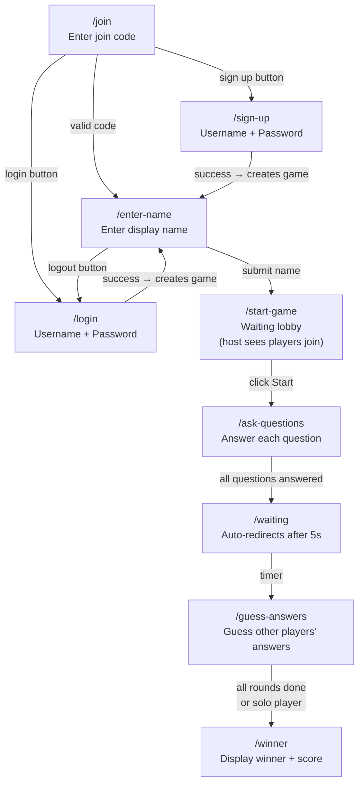

```mermaid
flowchart TD
    Join["/join<br/>Enter join code"] -->|valid code| EnterName["/enter-name<br/>Enter display name"]
    Join -->|login button| Login["/login<br/>Username + Password"]
    Join -->|sign up button| SignUp["/sign-up<br/>Username + Password"]

    Login -->|success → creates game| EnterName
    SignUp -->|success → creates game| EnterName

    EnterName -->|submit name| StartGame["/start-game<br/>Waiting lobby<br/>(host sees players join)"]
    EnterName -->|logout button| Login

    StartGame -->|click Start| AskQuestions["/ask-questions<br/>Answer each question"]

    AskQuestions -->|all questions answered| Waiting["/waiting<br/>Auto-redirects after 5s"]

    Waiting -->|timer| GuessAnswers["/guess-answers<br/>Guess other players' answers"]

    GuessAnswers -->|all rounds done<br/>or solo player| Winner["/winner<br/>Display winner + score"]
```
