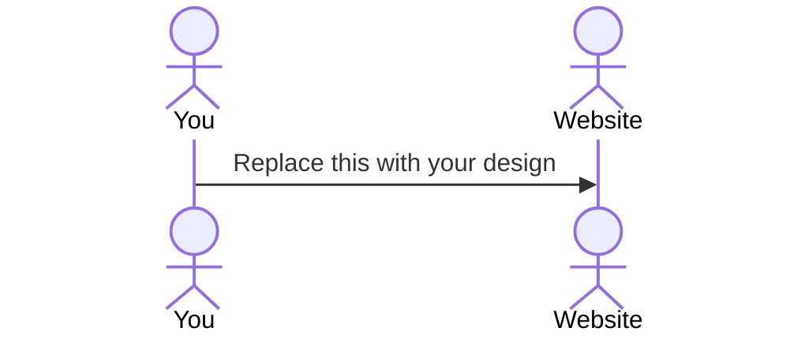

# Psychic Questions

[My Notes](notes.md)

Psychic Questions is a web application that provides a fun activity for a group of people to engage and connect with one another. Each person is asked four questions. Then they must guess everyone else's responses. The guesser goes through the four questions one at a time, and recieves feedback on what the correct answer was each time. For the first question they rely on random guesswork, but on the fourth question they can make an educated "psychic" guess based on the other three responses. Players win points by guessing correctly.

## 🚀 Specification Deliverable

> [!NOTE]
> Fill in this sections as the submission artifact for this deliverable. You can refer to this [example](https://github.com/webprogramming260/startup-example/blob/main/README.md) for inspiration.

For this deliverable I did the following. I checked the box `[x]` and added a description for things I completed.

- [ ] Proper use of Markdown
- [ ] A concise and compelling elevator pitch
- [ ] Description of key features
- [ ] Description of how you will use each technology
- [ ] One or more rough sketches of your application. Images must be embedded in this file using Markdown image references.

### Elevator pitch

Psychic questions is a sensational get-to-know-you game that you can play with your friends or classmates on any device. Is your friend a nerd? A jock? An actor? Some weird mesh of all 3? Everything you learn about them gets you deeper into their head, strengthening your psychic powers! Now you know everything about them! Or *do* you...

### Design

  

 

Lorem ipsum dolor sit amet, consectetur adipiscing elit, sed do eiusmod tempor incididunt ut labore et dolore magna aliqua. Ut enim ad minim veniam, quis nostrud exercitation ullamco laboris nisi ut aliquip ex ea commodo consequat. Duis aute irure dolor in reprehenderit in voluptate velit esse cillum dolore eu fugiat nulla pariatur. Excepteur sint occaecat cupidatat non proident, sunt in culpa qui officia deserunt mollit anim id est laborum.

### Key features

- Describe your key feature
- Describe your key feature
- Describe your key feature

### Technologies

I am going to use the required technologies in the following ways.

- **HTML** - Description here
- **CSS** - Description here
- **React** - Description here
- **Service** - Description here
- **DB/Login** - Description here
- **WebSocket** - Description here

## 🚀 AWS deliverable

For this deliverable I did the following. I checked the box `[x]` and added a description for things I completed.

- [ ] **Server deployed and accessible with custom domain name** - [My server link](https://yourdomainnamehere.click).

## 🚀 HTML deliverable

For this deliverable I did the following. I checked the box `[x]` and added a description for things I completed.

- [ ] **HTML pages** - I did not complete this part of the deliverable.
- [ ] **Proper HTML element usage** - I did not complete this part of the deliverable.
- [ ] **Links** - I did not complete this part of the deliverable.
- [ ] **Text** - I did not complete this part of the deliverable.
- [ ] **3rd party API placeholder** - I did not complete this part of the deliverable.
- [ ] **Images** - I did not complete this part of the deliverable.
- [ ] **Login placeholder** - I did not complete this part of the deliverable.
- [ ] **DB data placeholder** - I did not complete this part of the deliverable.
- [ ] **WebSocket placeholder** - I did not complete this part of the deliverable.

## 🚀 CSS deliverable

For this deliverable I did the following. I checked the box `[x]` and added a description for things I completed.

- [ ] **Visually appealing colors and layout. No overflowing elements.** - I did not complete this part of the deliverable.
- [ ] **Use of a CSS framework** - I did not complete this part of the deliverable.
- [ ] **All visual elements styled using CSS** - I did not complete this part of the deliverable.
- [ ] **Responsive to window resizing using flexbox and/or grid display** - I did not complete this part of the deliverable.
- [ ] **Use of a imported font** - I did not complete this part of the deliverable.
- [ ] **Use of different types of selectors including element, class, ID, and pseudo selectors** - I did not complete this part of the deliverable.

## 🚀 React part 1: Routing deliverable

For this deliverable I did the following. I checked the box `[x]` and added a description for things I completed.

- [ ] **Bundled using Vite** - I did not complete this part of the deliverable.
- [ ] **Components** - I did not complete this part of the deliverable.
- [ ] **Router** - I did not complete this part of the deliverable.

## 🚀 React part 2: Reactivity deliverable

For this deliverable I did the following. I checked the box `[x]` and added a description for things I completed.

- [ ] **All functionality implemented or mocked out** - I did not complete this part of the deliverable.
- [ ] **Hooks** - I did not complete this part of the deliverable.

## 🚀 Service deliverable

For this deliverable I did the following. I checked the box `[x]` and added a description for things I completed.

- [ ] **Node.js/Express HTTP service** - I did not complete this part of the deliverable.
- [ ] **Static middleware for frontend** - I did not complete this part of the deliverable.
- [ ] **Calls to third party endpoints** - I did not complete this part of the deliverable.
- [ ] **Backend service endpoints** - I did not complete this part of the deliverable.
- [ ] **Frontend calls service endpoints** - I did not complete this part of the deliverable.
- [ ] **Supports registration, login, logout, and restricted endpoint** - I did not complete this part of the deliverable.

## 🚀 DB deliverable

For this deliverable I did the following. I checked the box `[x]` and added a description for things I completed.

- [ ] **Stores data in MongoDB** - I did not complete this part of the deliverable.
- [ ] **Stores credentials in MongoDB** - I did not complete this part of the deliverable.

## 🚀 WebSocket deliverable

For this deliverable I did the following. I checked the box `[x]` and added a description for things I completed.

- [ ] **Backend listens for WebSocket connection** - I did not complete this part of the deliverable.
- [ ] **Frontend makes WebSocket connection** - I did not complete this part of the deliverable.
- [ ] **Data sent over WebSocket connection** - I did not complete this part of the deliverable.
- [ ] **WebSocket data displayed** - I did not complete this part of the deliverable.
- [ ] **Application is fully functional** - I did not complete this part of the deliverable.
