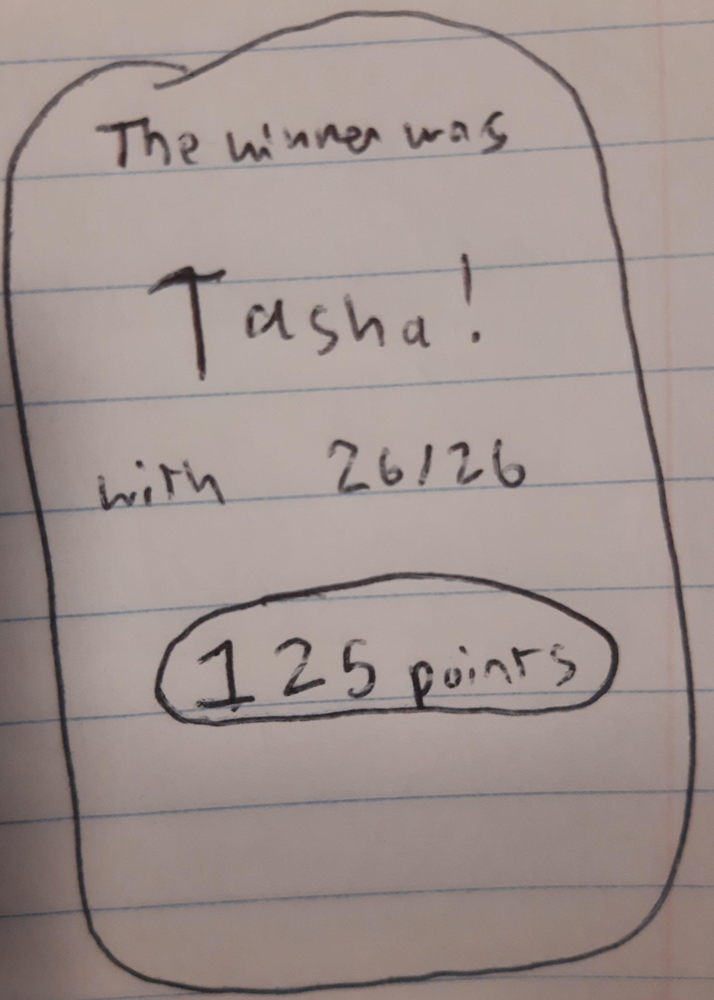
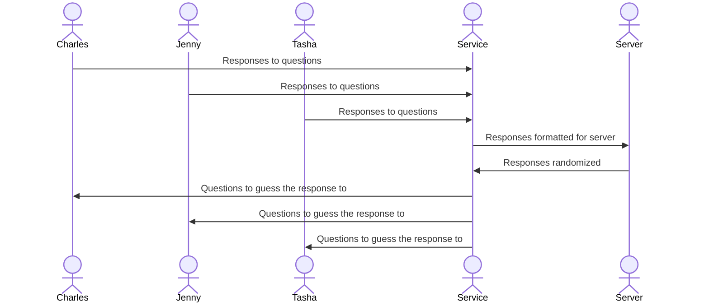

# Psychic Questions

[My Notes](notes.md)

Psychic Questions is a web application that provides a fun activity for a group of people to engage and connect with one another. Each person is asked four questions. Then they must guess everyone else's responses. The guesser goes through the four questions one at a time, and recieves feedback on what the correct answer was each time. For the first question they rely on random guesswork, but on the fourth question they can make an educated "psychic" guess based on the other three responses. Players win points by guessing correctly.

## 🚀 Specification Deliverable

For this deliverable I did the following:

- [x] Proper use of Markdown
- [x] A concise and compelling elevator pitch
- [x] Description of key features
- [x] Description of how you will use each technology
- [x] One or more rough sketches of your application. Images must be embedded in this file using Markdown image references.

### Elevator pitch

Psychic questions is a sensational get-to-know-you game that you can play with your friends or classmates on any device. Is your friend a nerd? A jock? An actor? Some weird mesh of all 3? Everything you learn about them gets you deeper into their head, strengthening your psychic powers! Now you know everything about them! Or *do* you...

### Design

One user must create an account and sign in to start the game. All of the other players can join with the join code. Each player can see a list of all of the players who have joined. Players must type in their name to join the game.

  

Each player must answer four questions about themselves to start off the game.

Each player will recieve the same questions as another player and try to guess what that player said. The questions are given in a random order, so the guesser can not leave the easy ones for last. Each time the guesser guesses they recieve immediate feedback on what the correct answer is. The idea is that the first response they must guess will be a shot in the dark, but for the remaining ones they will be able to make an educated guess based on the first three responses. As the guesser recieves each question the screen will become scrollable, so that it can all fit on the screen at once.

Question 1: 5 points  
Question 2: 10 points  
Question 3: 25 points  
Question 4: 50 points  

 

Whomever gets the most points wins!

In the sequence diagram each player interacts with the server to send in and recieve questions/responses.

### Key features

- Login authentication screen with securely stored password
- Join code allows each player to join
- Join screen shows number of players who have joined
- Waiting screen is displayed when waiting for other players responses
- Asks users questions and sends their names and their responses to a server
- Each player recieves the questions and answers of other players from the server
- Randomizes questions and possible responses
- Point system

### Technologies

I am going to use the required technologies in the following ways.

- **HTML** - Structure each screen (login screen, question screen, guessing screen).
- **CSS** - Make each screen look good (login screen, question screen, guessing screen).
- **React** - Users type in username and password, click to navigate between screens, scroll to look at all of the avaliable information on a screen, type in answers to questions, and click to select the correct response to a question.
- **Service** - Information is formatted correctly before being stored in server. Questions and answers are randomized.
- **DB/Login** - Securely stores credentials in database. Stores questions and answers for each individual. Stores point values of each player connecte dto their name.
- **WebSocket** - Broadcast message when users first enter the game, when users finish answering the questions, and when users finish guessing, so that everybody stays on the same page and goes from one phase to the next at the same time.

## 🚀 AWS deliverable

For this deliverable I did the following. I checked the box `[x]` and added a description for things I completed.

- [x] **Server deployed and accessible with custom domain name** - [My server link](https://joshuajob-cs.click).

## 🚀 HTML deliverable

For this deliverable I did the following. I checked the box `[x]` and added a description for things I completed.

- [x] **HTML pages** - I wrote HTML for each page of the application.
- [x] **Proper HTML element usage** - I used BODY, NAV, MAIN, HEADER, FOOTER and other HTML tags appropriately.
- [x] **Links** - Links to travel to each page of the application.
- [x] **Text** - Questions for the user.
- [x] **3rd party API placeholder** - I will use a 3rd party API that determines whose answers were similar to eachother. When someone is guessing the reponses of the person who is most like them, they get a "similarity score" that tells them how closely related their answers are.
- [x] **Images** - Images to inspire you.
- [x] **Login placeholder** - Created login page with username and password.
- [x] **DB data placeholder** - Player scores and responses stored in database.
- [x] **WebSocket placeholder** - Websocket used to know how many other players are joined. Sends a message as soon as they join.

## 🚀 CSS deliverable

For this deliverable I did the following. I checked the box `[x]` and added a description for things I completed.

- [x] **Visually appealing colors and layout. No overflowing elements.** - Resizes to make sure nothing overflows.
- [x] **Use of a CSS framework** - Dropdown menu.
- [x] **All visual elements styled using CSS** - Very beautiful and mysterious.
- [x] **Responsive to window resizing using flexbox and/or grid display** - Used flex on most pages and grid for players entering their names.
- [x] **Use of a imported font** - Imported two fonts.
- [x] **Use of different types of selectors including element, class, ID, and pseudo selectors** - Used all of these throughut the application. Used the hover pseudo selector.

## 🚀 React part 1: Routing deliverable

For this deliverable I did the following. I checked the box `[x]` and added a description for things I completed.

- [x] **Bundled using Vite** - The whole application uses Vite.
- [x] **Components** - Has all of the CSS components from earlier and the HTML jas been deleted and replaced with JSX
- [x] **Router** - See routing in app.jsx

## 🚀 React part 2: Reactivity deliverable

For this deliverable I did the following. I checked the box `[x]` and added a description for things I completed.

- [ ] **All functionality implemented or mocked out** - I did not complete this part of the deliverable.
- [ ] **Hooks** - I did not complete this part of the deliverable.

## 🚀 Service deliverable

For this deliverable I did the following. I checked the box `[x]` and added a description for things I completed.

- [ ] **Node.js/Express HTTP service** - I did not complete this part of the deliverable.
- [ ] **Static middleware for frontend** - I did not complete this part of the deliverable.
- [ ] **Calls to third party endpoints** - I did not complete this part of the deliverable.
- [ ] **Backend service endpoints** - I did not complete this part of the deliverable.
- [ ] **Frontend calls service endpoints** - I did not complete this part of the deliverable.
- [ ] **Supports registration, login, logout, and restricted endpoint** - I did not complete this part of the deliverable.

## 🚀 DB deliverable

For this deliverable I did the following. I checked the box `[x]` and added a description for things I completed.

- [ ] **Stores data in MongoDB** - I did not complete this part of the deliverable.
- [ ] **Stores credentials in MongoDB** - I did not complete this part of the deliverable.

## 🚀 WebSocket deliverable

For this deliverable I did the following. I checked the box `[x]` and added a description for things I completed.

- [ ] **Backend listens for WebSocket connection** - I did not complete this part of the deliverable.
- [ ] **Frontend makes WebSocket connection** - I did not complete this part of the deliverable.
- [ ] **Data sent over WebSocket connection** - I did not complete this part of the deliverable.
- [ ] **WebSocket data displayed** - I did not complete this part of the deliverable.
- [ ] **Application is fully functional** - I did not complete this part of the deliverable.

*Except where otherwise noted, this project is licensed under the MIT License. The Elephant.png file is not covered under the MIT license. I want to reserve the rights of the Elephant.png for my own logos/branding.*
